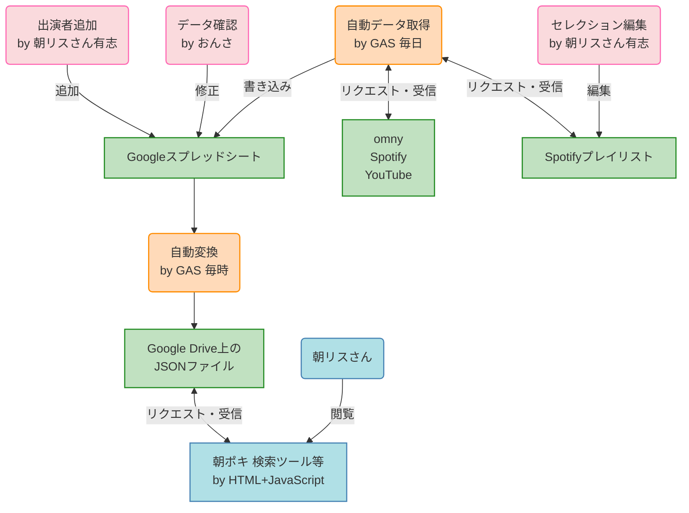

## 朝ポキツール システム図

```mermaid
graph TD;
    X(出演者追加<br>by 朝リスさん有志)
    Y(セレクション編集<br>by 朝リスさん有志)
    Z(データ確認<br>by おんさ)
    A(自動データ取得<br>by GAS 毎日)
    B(自動変換<br>by GAS 毎時)
    G[Googleスプレッドシート]
    J[Google Drive上の<br>JSONファイル]
    O[omny<br>Spotify<br>YouTube]
    S[Spotifyプレイリスト]
    R(朝リスさん)
    T[朝ポキ 検索ツール等<br>by HTML+JavaScript]
    X --> |追加| G;
    Z --> |修正| G;
    A --> |書き込み| G;
    A <--> |リクエスト・受信| O
    G --> B;
    B --> J;
    J <--> |リクエスト・受信| T;
    A <--> |リクエスト・受信| S;
    R --> |閲覧| T;
    Y --> |編集| S;

    style A fill:#FFDAB9,stroke:#FF8C00,stroke-width:1.5px;
    style B fill:#FFDAB9,stroke:#FF8C00,stroke-width:1.5px;

    style G fill:#C1E1C1,stroke:#228B22,stroke-width:1.5px;
    style J fill:#C1E1C1,stroke:#228B22,stroke-width:1.5px;
    style O fill:#C1E1C1,stroke:#228B22,stroke-width:1.5px;
    style S fill:#C1E1C1,stroke:#228B22,stroke-width:1.5px;

    style R fill:#B0E0E6,stroke:#4682B4,stroke-width:1.5px;
    style T fill:#B0E0E6,stroke:#4682B4,stroke-width:1.5px;

    style X fill:#FADADD,stroke:#FF69B4,stroke-width:1.5px;
    style Y fill:#FADADD,stroke:#FF69B4,stroke-width:1.5px; 
    style Z fill:#FADADD,stroke:#FF69B4,stroke-width:1.5px; 
```
