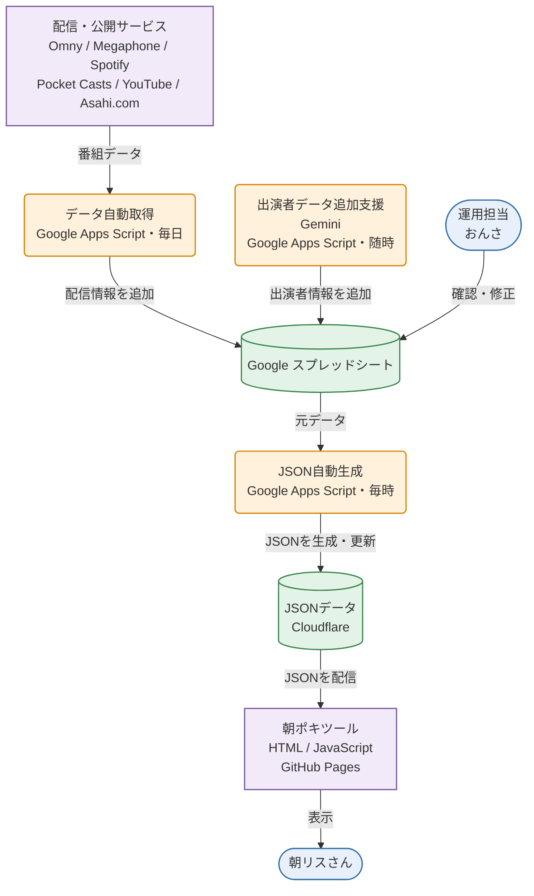

## 朝ポキツール システム図

```mermaid
flowchart TD
    O[配信・公開サービス<br>Omny / Megaphone / Spotify<br>Pocket Casts / YouTube / Asahi.com]
    Z([運用担当<br>おんさ])

    A(データ自動取得<br>Google Apps Script・毎日)
    X(出演者データ追加支援<br>Gemini<br>Google Apps Script・随時)

    G[(Google スプレッドシート)]
    B(JSON自動生成<br>Google Apps Script・毎時)
    J[(JSONデータ<br>Cloudflare)]

    T[朝ポキツール<br>HTML / JavaScript<br>GitHub Pages]
    R([朝リスさん])

    O -->|番組データ| A
    A -->|配信情報を追加| G
    X -->|出演者情報を追加| G
    Z -->|確認・修正| G
    G -->|元データ| B
    B -->|JSONを生成・更新| J
    J -->|JSONを配信| T
    T -->|表示| R

    classDef person fill:#E8F1FB,stroke:#3973AC,stroke-width:1.5px;
    classDef process fill:#FFF1DB,stroke:#D98200,stroke-width:1.5px;
    classDef datastore fill:#E4F3E7,stroke:#36874A,stroke-width:1.5px;
    classDef service fill:#F2EAF8,stroke:#79589F,stroke-width:1.5px;

    class R,Z person;
    class A,X,B process;
    class G,J datastore;
    class O,T service;
```
